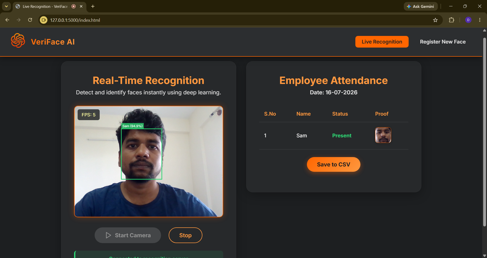

# VeriFace AI - Advanced Multi-Face Recognition

VeriFace AI is a real-time, deep learning-based face detection and recognition system built with PyTorch, Flask, and WebSockets. It enables live multi-face recognition, employee attendance tracking, and allows users to register new faces seamlessly through a modern web interface.

## 🖥️ User Interface


## 🏗️ System Architecture


## ✨ Features
- **Real-Time Recognition**: Fast and accurate multi-face recognition using live camera feeds via WebSockets (`Socket.IO`).
- **New Face Registration**: Intuitive web interface to capture and register new faces directly into the system database.
- **Attendance Tracking**: Automatically logs recognized faces and provides an exportable employee attendance table (CSV).
- **Deep Learning Pipeline**: Uses robust Face Detection and Facenet-PyTorch models for high-accuracy face embeddings.

## 🛠️ Tech Stack
- **Backend**: Python, Flask, Flask-SocketIO, Flask-CORS
- **Computer Vision & ML**: OpenCV, PyTorch, Facenet-PyTorch, Scikit-Learn, NumPy
- **Frontend**: HTML5, CSS3, Vanilla JavaScript, Socket.IO client
- **Storage**: File-based pickled embeddings database (`embeddings.pkl`)

## 📂 Project Structure
```text
VeriFace-Advance_Multi_Face_recognition/
├── backend/
│   ├── app.py                 # Main Flask application
│   ├── database/              # Database handler (db.py)
│   ├── models/                # FaceDetector and FaceEmbedder models
│   ├── routes/                # API routes (register_face, recognize_face)
│   └── services/              # Core business logic (embedding_service.py)
├── frontend/
│   ├── index.html             # Live Recognition UI
│   ├── register.html          # Registration UI
│   ├── detect.js              # Real-time detection logic
│   ├── register.js            # Registration logic
│   └── styles.css             # UI styling
├── dataset/                   # Directory storing registered face images
├── embeddings/                # Stores generated embeddings (embeddings.pkl)
├── notebooks/                 # Jupyter notebooks for experimentation
└── requirements.txt           # Python dependencies
```

## 🚀 Setup & Installation

### Prerequisites
- Python 3.8+
- A working webcam

### 1. Clone the Repository
```bash
git clone <your-repository-url>
cd VeriFace-Advance_Multi_Face_recognition
```

### 2. Install Dependencies
It is highly recommended to use a virtual environment.
```bash
python -m venv .venv

# On Windows:
.venv\Scripts\activate
# On Linux/Mac:
source .venv/bin/activate

pip install -r requirements.txt
```

### 3. Run the Application
```bash
python backend/app.py
```
The application will launch on `http://localhost:5000` (or `http://0.0.0.0:5000`). Access it from your browser.

## 💡 Usage
1. **Live Recognition**: Navigate to the home page. Click "Start Camera" to begin real-time face detection and attendance logging.
2. **Register a New Face**: Go to the "Register New Face" tab in the navigation menu. Enter the person's name and capture frames to save their face embeddings into the dataset.
3. **Export Attendance**: On the Live Recognition page, click "Save to CSV" to export the day's attendance log.

## 📄 License
This project is licensed under the terms of the included LICENSE file.
